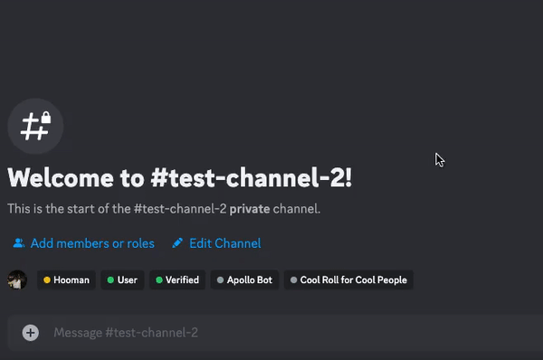
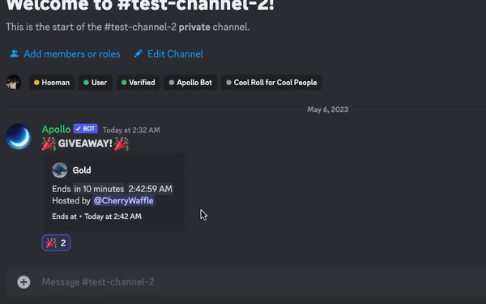
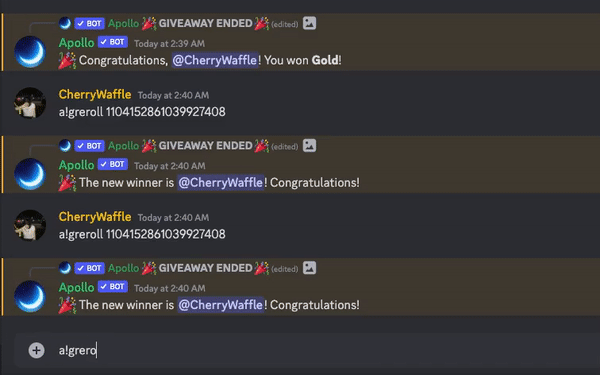

# Giveaways

As you know apollo has a very sophisticated and advanced giveaway system. This page will walk through each and every command in detail so you can use the most out of apollo giveaway system.

## Giveaway Management Commands

### a!wins

> This command shows the amount of win counts of giveaways hosted in the particular server and in all the servers apollo is in. In addition to the count, this command also shows what prize has been won by that particular user.

<figure><figcaption>
Checking wins for self
</figcaption></figure>

 

<figure><figcaption>
Checking wins for other users
</figcaption></figure>

### a!glist

> This command shows all the active and ended giveaways in the particular server across all channels. This command also shows other information like giveaway host, giveaway winner of ended giveaways, and the channel the giveaway is in.&#x20;

<figure><figcaption></figcaption></figure>

This command sends a button to view all the giveaways in paginator (page embed) form, as shown below.&#x20;

<figure><figcaption>
Page 1 (Ongoing Giveaway)
</figcaption></figure>

 

<figure><figcaption>
Page 2 (Ongoing Giveaway)
</figcaption></figure>

<figure><figcaption>
Page 3 (Ended Giveaway)
</figcaption></figure>

 

<figure><figcaption>
Page 4 (Ended Giveaway)
</figcaption></figure>

### a!winrole (winroleset/remove)

> This command shows the roles that are to be added to the winner after they have won a giveaway. a!winrole set adds a new role to be added to the winners whereas a!winrole remove will delete the role to be added to winners.

<figure><figcaption>
More than one role can be added too
</figcaption></figure>


This command is a premium only command, to know more please goto the [premium](../premium.md) tab


### a!managerole

> This command allows you to assign a giveaway manager role. By using this command you dont need to give the giveaway host the `manage server` permission, as simply assigning this role to the host will allow them to host and control giveaways.

<figure><figcaption></figcaption></figure>


This command is a premium only command, to know more please goto the [premium](../premium.md) tab


## Giveaway Host Commands

### a!gstart

> This command is used to start giveaways in a particular channel. The format to use this command is `a!gstart <time> <winners> <prize>`. Once you have entered the parameters, Apollo will automatically delete your message and start a giveaway in that particular channel.\
> \
> For Example to host a giveaway with 2 winners, time of 1 hour and prize of Gold, we type in `a!gstart 1h 2 Gold`

<figure><figcaption>
Example giveaway
</figcaption></figure>

### a!gend

> This command is used to end a particular giveaway in a particular channel. If there are more than one giveaways running at the same time then you can use `a!gend <messageid>` to end that particular giveaway, as we replace `<messageid>` with the id of the giveaway.

<figure><figcaption>
Ending giveaway
</figcaption></figure>

### a!greroll

This command rerolls the winner of a perticular giveaway. When multiple giveaways are running then you can use `a!greroll <messageid>` to reroll that particular giveaway. Here `<messageid>` is the id of the message of the giveaway.

<figure><figcaption>
Rerolling Giveaway
</figcaption></figure>

## Giveaway Control Commands

### a!gwblacklist

> This command blacklists a particular user from reacting/participating in giveaways by automatically unreacting to giveaways in the particular server. This command only applies to the local server and not the global giveaway blacklist (i.e. the user can still participate in other giveaways hosted by apollo in other servers)\
> \
> Just type in `a!gwblacklist <@user>` to blacklist them from all giveaways in your server.

<figure><figcaption>
User Successfully Blacklisted
</figcaption></figure>

### a!gdelete

This command deletes the giveaway log from the a!glist database. To delete a particular giveaway just use the a!gdelete command followed by the giveaway message id that can be obtained either directly from the message or from the [a!glist](giveaways.md#a-glist) command.

<figure><figcaption>
Bot confirming to delete the particular giveaway
</figcaption></figure>

<figure><figcaption>
Giveaway Successfully Deleted
</figcaption></figure>

 

<figure><figcaption>
Original Giveaway Message also is deleted
</figcaption></figure>

