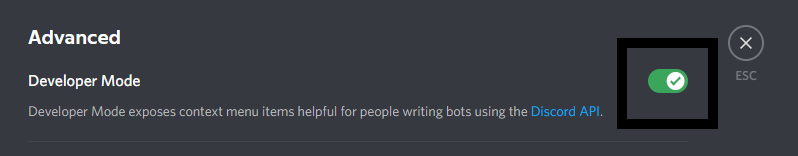
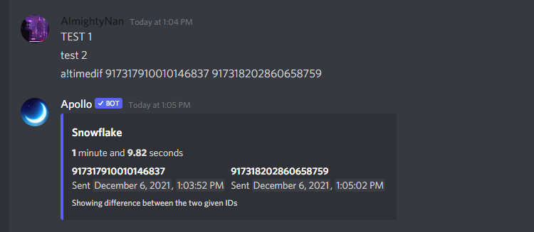
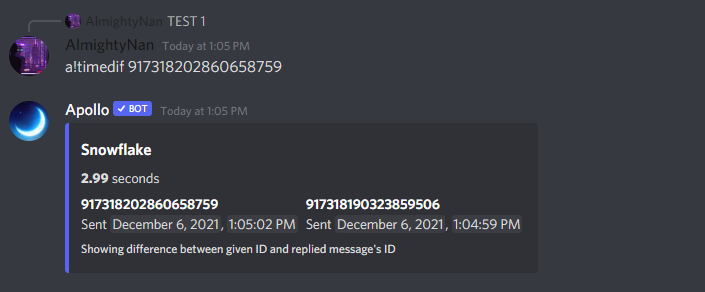

# How to use timedif

The `timedif` command is used for checking the time difference between two Discord object IDs.&#x20;


All Discord IDs like user IDs, message IDs, role IDs, etc. are just timestamps, but encoded. This command decodes the IDs to get the timestamp and compares it to the other one to get the difference.


## Step 1 - Developer Mode

In Discord, enabling developer mode allows users to copy any object ID by right-clicking it. Follow the steps below to enable it for yourself.

1. Click On The Gear Icon On Your Bottom Left.

2\. Click On The Option Named "Advanced" In Your Settings.

3\. Enable The Developer Mode Using The Toggle Button.

### Step 2 - Usage

Your usage must be `a!timedif <message_id1> [message_id2]` where message\_id2 is optional by replying to the actual message. 2 Types of timedif are available and are listed below.

* 1st type is by copying and pasting 2 message ID's to check timedif.

* 2nd type is by replying to first message and pasting the second message ID to check timedif.

